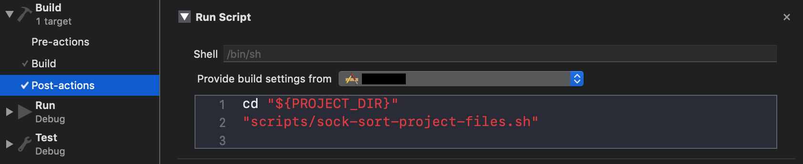

# XcodeProject-Tools

A cache of tools and scripts to help setting up Xcode projects, 
for easier git co-contribution and minimise merge conflicts.

## Basic Steps

### Create project

With Xcode ;)

### Add `.gitignore` to project root directory.

[Example](https://github.com/github/gitignore/blob/master/Swift.gitignore).

### Add customised text macros

Refer to [Xcode Help: Customize text macros](https://help.apple.com/xcode/mac/10.2/#/dev91a7a31fc), add `IDETemplateMacros.plist` to one of the following directories:
	
- Project user data: `<ProjectName>.xcodeproj/xcuserdata/[username].xcuserdatad/IDETemplateMacros.plist`
- Project shared data (recommended as it can be checked in by git): `<ProjectName>.xcodeproj/xcshareddata/IDETemplateMacros.plist`
- Workspace user data: `<WorkspaceName>.xcworkspace/xcuserdata/[username].xcuserdatad/IDETemplateMacros.plist`
- Workspace shared data (recommended as it can be checked in by git): `<WorkspaceName>.xcworkspace/xcshareddata/IDETemplateMacros.plist`
- User Xcode data: `~/Library/Developer/Xcode/UserData/IDETemplateMacros.plist`

### Configure post-build project file sorting

Download [SOCK](https://github.com/Polidea/SOCK), then add `sock_sort_project_file` script to _build scheme_ _post-build action_:



```
cd "${PROJECT_DIR}"
"scripts/sock-sort-project-files.sh"
```

This helps to minimise merge conflicts on project file.

### Configure Swiftlint

1. Install [Swiftlint](https://github.com/realm/SwiftLint) with Homebrew
2. Add `.swiftlint.yml` to project root directory. [Example](./swiftlint/.swiftlint.yml).
3. In project _Build Phases_ add a _New Run Scrip Phase_ under _Target Dependencies_:

	

	```
	swiftlint --config "${PROJECT_DIR}/.swiftlint.yml" --path "$	{PROJECT_DIR}/path_to_yml_file"
	```

4. Build the project and fix Swiftlint warnings before commiting.

### Configure SwiftFormat

1. Run `brew install swiftformat`. This installs the latest version of [SwiftFormat](https://github.com/nicklockwood/SwiftFormat).
	- If you need older version of SwiftFormat, download the version you need from its [release archive](https://github.com/nicklockwood/SwiftFormat/releases). Copy the included `CommandLineTool/swiftformat` binary to your `/usr/local/bin/` directory.
2. Setup auto-execution
	- For personal project, follow the [instructions](https://github.com/nicklockwood/SwiftFormat#git-pre-commit-hook) to edit git commit hook.
	- For collaboration project, in project _Build Phases_ add a _New Run Scrip Phase_ to create a symbolic link to the script:

	
	
	```
	mkdir -p .git/hooks
cd .git/hooks
ln -sf ../../scripts/hooks/pre-commit pre-commit
	```
	
	After the setup, `git commit` should trigger SwiftFormat.


### Configure dependencies 

With [Carthage](https://github.com/Carthage/Carthage) or [CocoaPods](https://cocoapods.org/).


### Configure Fastlane

The fun part. 🤦‍♀️

## Useful Tricks

### Supporting latest version iOS

Sometimes due to dependencies on third-party libraries, you can't yet migrate to latest version Xcode while still needing to debug on latest version iOS.
To support latest version iOS that is not supported by your current version Xcode, install the latest version Xcode and symbolic-link device support, for example:

```
sudo ln -s /Applications/Xcode_10.3/Xcode.app/Contents/Developer/Platforms/iPhoneOS.platform/DeviceSupport/12.3/ /Applications/Xcode_10.1/Xcode.app/Contents/Developer/Platforms/iPhoneOS.platform/DeviceSupport
```